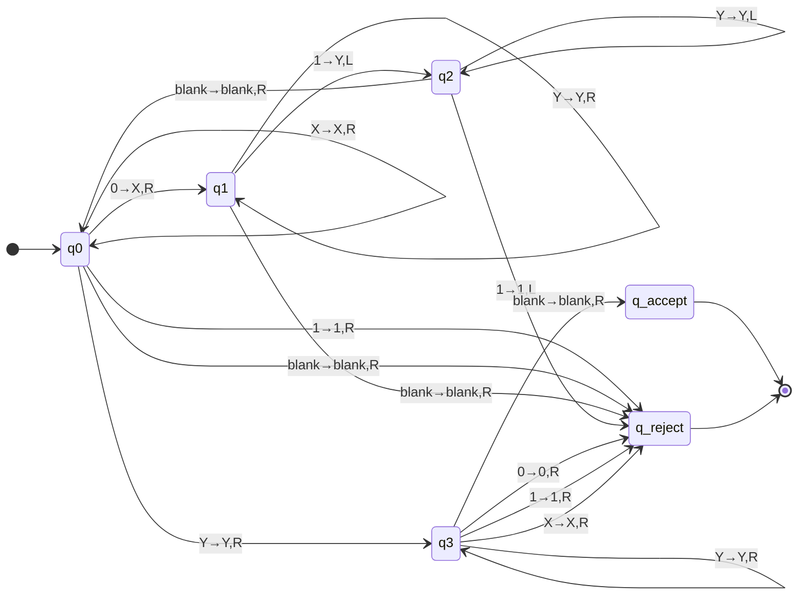

# Turing Machine Design for $L_3 = \{0^n1^n \mid n \geq 1\}$

## Problem Statement
Design a deterministic Turing Machine $M_1$ that recognizes the language:
**$L_3 = \{0^n1^n \mid n \geq 1\}$** over the alphabet $\Sigma = \{0, 1\}$

---

## (i) Turing Machine Construction

### Formal Definition
**Turing Machine $M_1$:**

$M_1 = (Q, \Sigma, \Gamma, \delta, q_0, q_{accept}, q_{reject})$

Where:
- **$Q$** = $\{q_0, q_1, q_2, q_3, q_{accept}, q_{reject}\}$
- **$\Sigma$** = $\{0, 1\}$ (Input alphabet)
- **$\Gamma$** = $\{0, 1, X, Y, \sqcup\}$ (Tape alphabet)
  - $X$: Marks a matched $0$
  - $Y$: Marks a matched $1$  
  - $\sqcup$: Blank symbol
- **$q_0$**: Start state
- **$q_{accept}$**: Accept state
- **$q_{reject}$**: Reject state

### State Diagram


### Complete Transition Table

| Current State | Read | Write | Move | Next State | Explanation |
|---------------|------|-------|------|------------|-------------|
| $q_0$ | $0$ | $X$ | $R$ | $q_1$ | Mark $0$ and seek matching $1$ |
| $q_0$ | $X$ | $X$ | $R$ | $q_0$ | Skip marked $0$'s |
| $q_0$ | $Y$ | $Y$ | $R$ | $q_3$ | All $0$'s processed, verify $1$'s |
| $q_0$ | $1$ | $1$ | $R$ | $q_{reject}$ | $1$ before any $0$ - wrong order |
| $q_0$ | $\sqcup$ | $\sqcup$ | $R$ | $q_{reject}$ | Empty input or premature end |

| $q_1$ | $0$ | $0$ | $R$ | $q_1$ | Continue through unmarked $0$'s |
| $q_1$ | $X$ | $X$ | $R$ | $q_1$ | Skip marked $0$'s |
| $q_1$ | $Y$ | $Y$ | $R$ | $q_1$ | Skip marked $1$'s |
| $q_1$ | $1$ | $Y$ | $L$ | $q_2$ | Found unmarked $1$, mark it |
| $q_1$ | $\sqcup$ | $\sqcup$ | $R$ | $q_{reject}$ | No $1$ to match this $0$ |

| $q_2$ | $0$ | $0$ | $L$ | $q_2$ | Move left through unmarked $0$'s |
| $q_2$ | $X$ | $X$ | $L$ | $q_2$ | Move left through marked $0$'s |
| $q_2$ | $Y$ | $Y$ | $L$ | $q_2$ | Move left through marked $1$'s |
| $q_2$ | $\sqcup$ | $\sqcup$ | $R$ | $q_0$ | Reached start, next iteration |
| $q_2$ | $1$ | $1$ | $L$ | $q_{reject}$ | $1$ in $0$'s region - wrong pattern |

| $q_3$ | $Y$ | $Y$ | $R$ | $q_3$ | All good, continue verification |
| $q_3$ | $\sqcup$ | $\sqcup$ | $R$ | $q_{accept}$ | Success! All symbols matched |
| $q_3$ | $0$ | $0$ | $R$ | $q_{reject}$ | Unmatched $0$ found |
| $q_3$ | $1$ | $1$ | $R$ | $q_{reject}$ | Unmatched $1$ found |
| $q_3$ | $X$ | $X$ | $R$ | $q_{reject}$ | Shouldn't happen, but reject |

### Algorithm Description
```
1. Start in q₀, scan right to find first unmarked 0
   - If find 1 first or blank, reject (wrong order or empty)
   
2. Mark 0 with X, enter q₁ to find matching 1
   - Scan right through all symbols until first unmarked 1
   - If reach blank, reject (no matching 1)
   
3. Mark 1 with Y, enter q₂ to return to start
   - Move left until reaching start (blank)
   - Return to q₀ for next iteration
   
4. Repeat until all 0's marked
   - When q₀ sees Y instead of 0, enter q₃ for verification
   
5. Verify all 1's are marked in q₃
   - Scan right through Y's
   - If reach blank, accept
   - If find any unmarked symbol, reject
```

---

## Detailed Example Computations

### Example 1: Input "$01$" ($n=1$) - ACCEPT
```
Step  Configuration        Action
0     q₀ 0 1             Start
1     X q₁ 1             Mark 0, seek 1
2     X q₂ Y             Mark 1, return
3     q₂ X Y             Move left
4     $\sqcup$ q₀ X Y           Reach start
5     X q₀ Y             Skip X
6     X Y q₃ $\sqcup$           Begin verification
7     X Y $\sqcup$ q_accept     ✓ ACCEPT
```

### Example 2: Input "$0011$" ($n=2$) - ACCEPT
```
Step  Configuration        Action
0     q₀ 0 0 1 1         Start
1     X q₁ 0 1 1         Mark first 0
2     X 0 q₁ 1 1         Continue
3     X 0 q₂ Y 1         Mark first 1
4     X q₂ 0 Y 1         Return left
5     q₂ X 0 Y 1         Return left
6     $\sqcup$ q₀ X 0 Y 1       Reach start
7     X q₀ 0 Y 1         Next iteration
8     X X q₁ Y 1         Mark second 0
9     X X Y q₁ 1         Skip marked 1
10    X X Y q₂ Y         Mark second 1
11    X X q₂ Y Y         Return left
12    X q₂ X Y Y         Return left
13    q₂ X X Y Y         Return left
14    $\sqcup$ q₀ X X Y Y       Reach start
15    X q₀ X Y Y         Skip first X
16    X X q₀ Y Y         Skip second X
17    X X Y q₃ Y         Begin verification
18    X X Y Y q₃ $\sqcup$       Continue verification
19    X X Y Y $\sqcup$ q_accept ✓ ACCEPT
```

### Example 3: Input "$001$" - REJECT
```
Step  Configuration        Action
0     q₀ 0 0 1           Start
1     X q₁ 0 1           Mark first 0
2     X 0 q₁ 1           Continue
3     X 0 q₂ Y           Mark first 1
...   ...                (Return to start)
7     $\sqcup$ q₀ X 0 Y         Reach start
8     X q₀ 0 Y           Next iteration
9     X X q₁ Y           Mark second 0
10    X X Y q₁ $\sqcup$         No 1 to match! → REJECT
```

### Example 4: Input "$0101$" - REJECT
```
Step  Configuration        Action
0     q₀ 0 1 0 1         Start
1     X q₁ 1 0 1         Mark first 0
2     X q₂ Y 0 1         Mark first 1
3     q₂ X Y 0 1         Return left
4     $\sqcup$ q₀ X Y 0 1       Reach start
5     X q₀ Y 0 1         Skip X
6     X Y q₃ 0 1         Begin verification
7     X Y 0 q_reject 1   Found 0 → REJECT
```

### Example 5: Input "$" (empty) - REJECT
```
Step  Configuration        Action
0     q₀ $\sqcup$               Start
1     $\sqcup$ q_reject         Empty input → REJECT
```

---

## (ii) Is $M_1$ a Decider?

**Yes, $M_1$ is a decider.**

### Proof that $M_1$ Always Halts

A Turing machine is a **decider** if it:
1. Accepts all strings in the language
2. Rejects all strings not in the language  
3. **Always halts** (never loops infinitely) on every input

#### Termination Analysis

**For any input string $w$:**
- Each complete iteration ($q_0 \to q_1 \to q_2 \to q_0$) marks exactly one $0$ and one $1$
- Maximum possible iterations = $\min(\text{count}(0), \text{count}(1)) \leq |w|/2$
- Each iteration performs bounded work:
  - $q_0$: Scans through at most $|w|$ symbols
  - $q_1$: Scans through at most $|w|$ symbols  
  - $q_2$: Scans through at most $|w|$ symbols
- Total operations $\leq |w|^3$ (polynomial bound)

**Case Analysis:**

1. **$w \in L_3 = \{0^n1^n \mid n \geq 1\}$:**
   - Exactly $n$ iterations, each marking one $(0,1)$ pair
   - Ends in $q_3$, verifies only $Y$'s remain, accepts
   - **Halts in accept state**

2. **$w \notin L_3$:**
   - **Wrong count ($0^n1^m$, $n \neq m$):** Either runs out of $1$'s in $q_1$ ($n>m$) or finds unmarked $1$'s in $q_3$ ($n<m$)
   - **Wrong order:** Rejects immediately in $q_0$ ($1$ before $0$) or $q_2$ ($1$ in $0$'s region)
   - **Mixed pattern:** Rejects in $q_3$ when finding $0/1$ during verification
   - **Empty string:** Rejects immediately in $q_0$
   - **Always halts in reject state**

#### No Infinite Loops Possible
- The number of unmarked symbols strictly decreases each iteration
- Machine progresses monotonically through the input
- All transitions are well-defined for all symbols
- No cycles exist except the productive marking cycle

### Conclusion
Since $M_1$:
-  **Accepts** all strings in $L_3$
-  **Rejects** all strings not in $L_3$  
-  **Halts on every input** in finite time

**$M_1$ is a decider** and therefore **$L_3$ is Turing-decidable**.

---

## Additional Properties

**Time Complexity:** $O(n^2)$ where $n = |w|$
- $n$ iterations, each requiring $O(n)$ head movements

**Space Complexity:** $O(n)$
- Uses only the input tape plus constant overhead

**Design Notes:**
- Follows standard cross-off method for context-free language recognition
- Ensures proper $0^n1^n$ structure enforcement
- All transitions explicitly defined for decidability
- Efficient verification phase for final checking